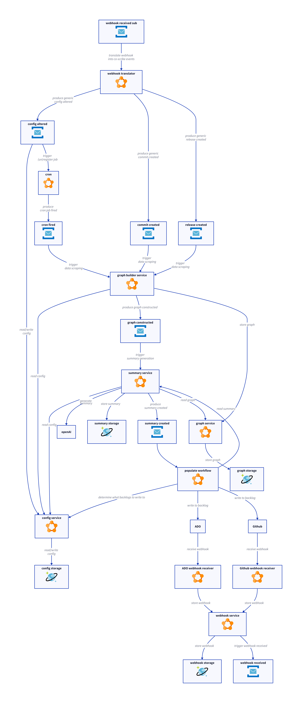

## High Level

Azure Static Web App resolves static resources such as html, css and javascript files. An Azure Function app is "linked" to the static web app so that requests directly to the static web app via routes that match ~/api/* are auto-magically proxied to the correct resource.